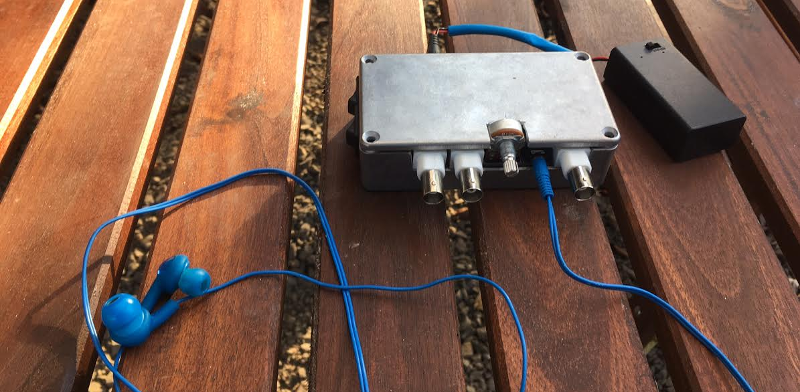
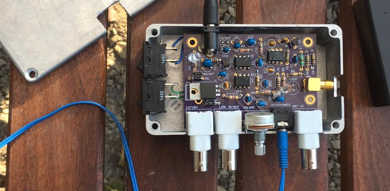
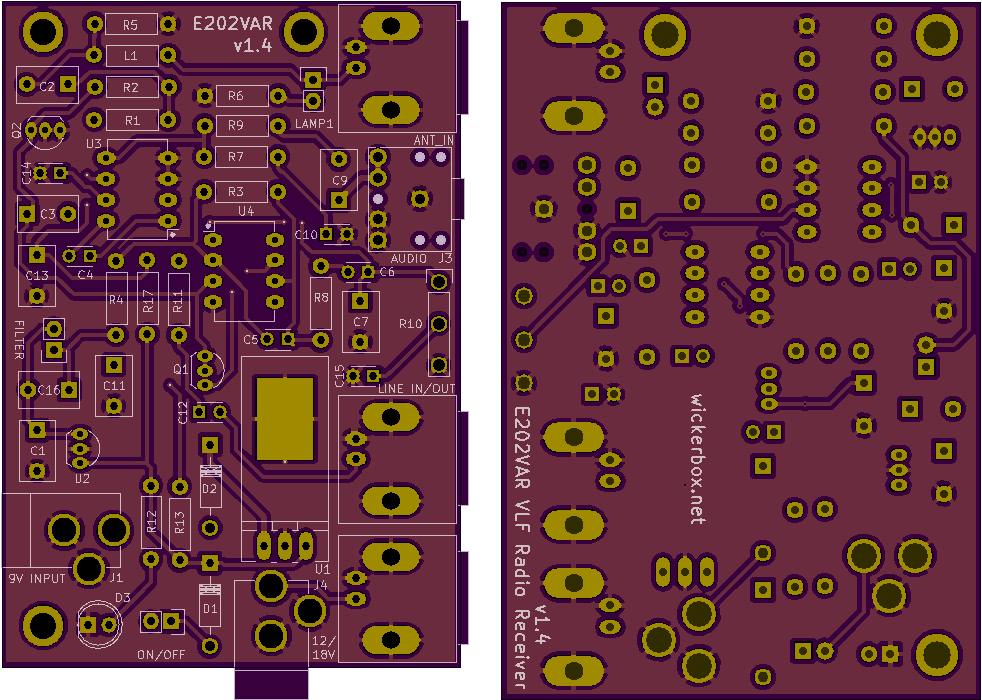

## Introduction

This project is based on the Explorer E202, with permission. 

Renato Romero put plans online for a Very Low Frequency (VLF) receiver capable between "a few Hz to beyond 10 kHz [which] makes it suitable to to receive radio signals of natural origin; signals not generated by human activity but by physical phenomena such as lightning and solar storms. Received signals are heard directly in your headset. The receiver amplifies the electric component of an electromagnetic signal."

His plans are <a href="http://www.vlf.it/romero2/explorer-e202.html">described here</a>. The Explorer E202 is no longer available for sale.

He gave me permission to work from his schematic to design a new layout and make my own units. I am releasing all of my documents and process under the CERN Open Hardware License v1.2.

<a href="http://www.vlf.it/romero2/E202_V1.1.png">Here's the original E202 full-size schematic</a>.

## Version 1.1

For version 1.1, I was able to solder all the components, place the board in the metal box, apply a 9V battery for power, turn on the blue LED, and verify the basics of the operation. 

The volume knob, filter and power switches, and headphone jack all work correctly. I could hear the received sound in my headphones and it changed pitch and volume as I adjusted ground connections, turned the volume knob, and moved my hand around in the air over the box.

\ 
\ 

\  

\pagebreak

## Version 1.4

I ordered v1.4 boards from OSH Park and should have them in hand by March 10th.

### Bill of Materials 

Total cost of parts is about $25 if you order minimums. It's about $100 if you go to the next price break for most at qty=10, which is what I did since I'm prototyping, and what I recommend if you want to build two or more units. 

OSH Park: $35.35 for a set of three bare boards

Digikey cart: To Be Linked Soon

<!--- bom start --->
### Bill of Materials

|Ref|Qty|Description|Digikey PN|
|---|---|-----------|------|
|BNC1 BNC2 BNC3|3|CONN BNC JACK R/A 50 OHM PCB|A97555-ND|
|C1|1|CAP CER 0.033UF 50V C0G RADIAL|445-8490-ND|
|C10|1|CAP CER 10000PF 50V C0G RADIAL|445-8384-ND|
|C15 C14|2|CAP CER 0.022UF 50V X7R RADIAL|399-14089-2-ND|
|C16 C7|2|CAP CER 4700PF 50V C0G RADIAL|445-8585-ND|
|C2 C11|2|CAP CER 0.1UF 50V C0G RADIAL|445-8532-ND|
|C3|1|CAP CER 8.2PF 50V NP0 RADIAL|399-8923-ND|
|C5|1|CAP CER 150PF 50V NP0 RADIAL|BC1015CT-ND|
|C6 C12 C4|3|CAP CER 10UF 16V X5R RADIAL|445-8290-ND|
|C9 C13|2|CAP CER 100UF 6.3V X5R RADIAL|445-8441-ND|
|D1 D2|2|DIODE GEN PURP 50V 1A DO41|1N4001-TPMSCT-ND|
|D3|1|LED BLUE CLEAR 5MM ROUND T/H|C503B-BCS-CV0Z0461-ND|
|J1 J4|2|CONN PWR JACK 2.5X5.5MM HIGH CUR|PJ-202BH|
|J2 J5|2|CONN TERM SCREW GREEN 2.54MM 2POS TH|ED10561-ND|
|J3|1|CONN JACK STEREO R/A 3PIN 3.5MM|CP1-3523N-ND|
|L1|1|FIXED IND 3.3UH 575MA 300 MOHM|78F3R3J-RC-ND|
|LAMP1|1|LAMP NEON 6.2MM WIRE TERMINAL|A9A-ND|
|Q1 Q2|2|TRANS NPN 45V 0.1A TO-92|BC547BTACT-ND|
|R10|1|POT 10K OHM 1/5W PLASTIC LINEAR|987-1301-ND|
|R11|1|RES 4.7K OHM 1/4W 5% CF MINI|S4.7KQCT-ND|
|R12|1|RES 2.2K OHM 1/4W 5% CARBON FILM|CF14JT2K20CT-ND|
|R13|1|RES 1K OHM 1/4W 5% CF MINI|S1KQCT-ND|
|R4|1|RES 3.3K OHM 1/4W 5% CARBON FILM|CF14JT3K30CT-ND|
|R5 R1|2|RES 10M OHM 1/4W 5% CARBON FILM|CF14JT10M0CT-ND|
|R6 R2 R3|3|RES 100K OHM 1/4W 5% CARBON FILM|CF14JT100KCT-ND|
|R7|1|RES 10 OHM 1/4W 5% CARBON FILM|CF14JT10R0CT-ND|
|R8|1|RES 10K OHM 1/4W 5% CF MINI|S10KQCT-ND|
|R9 R17|2|RES 33 OHM 1/4W 5% CARBON FILM|CF14JT33R0CT-ND|
|U1|1|IC REG LDO 9V 1A MC7809 TO220AB|MC7809CTGOS-ND|
|U2|1|IC VREF GND REF ADJ TO92|296-6549-5-ND|
|U3|1|IC AUDIO PWR AMP LOW VOLT 8-DIP|NJM386D-ND|
|U4|1|IC OPAMP JFET 3MHZ DIP8|296-7203-5-ND|

<!--- bom end --->

\pagebreak

### Gerber Preview

\pagebreak

### Assembly Diagram

